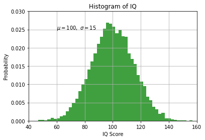

# Intro to Numpy for Data Science

## IMQAV:
1. Ingest
2. Model
3. Query
4. **Analyse** <-- *Numpy comes here*
5. Visualise

## Notes:

- Basic data strucuture in Numpy is an **array**.


```python
import numpy as np
```


```python
print (np.__version__)
```

    1.20.2


## Creating Numpy arrays using Python's "array-like" data types


```python
my_list = [-17, 0, 4, 5, 9]
my_array_from_list = np.array(my_list)
my_array_from_list
```


    array([-17,   0,   4,   5,   9])


```python
my_array_from_list * 10
```


    array([-170,    0,   40,   50,   90])


```python
my_tuple = (14, -3.54, 5+7j)
np.array(my_tuple)
```


    array([14.  +0.j, -3.54+0.j,  5.  +7.j])


```python
my_tuple * 6
```


    (14,
     -3.54,
     (5+7j),
     14,
     -3.54,
     (5+7j),
     14,
     -3.54,
     (5+7j),
     14,
     -3.54,
     (5+7j),
     14,
     -3.54,
     (5+7j),
     14,
     -3.54,
     (5+7j))


```python
np.array(my_tuple) * 6
# difference with python data structures!
```


    array([ 84.   +0.j, -21.24 +0.j,  30.  +42.j])


## Numpy array creation using intrinsic methods


```python
np.arange(7)
```


    array([0, 1, 2, 3, 4, 5, 6])


```python
np.arange(10, 23)
```


    array([10, 11, 12, 13, 14, 15, 16, 17, 18, 19, 20, 21, 22])


```python
np.arange(10, 23) -10
```


    array([ 0,  1,  2,  3,  4,  5,  6,  7,  8,  9, 10, 11, 12])


```python
np.arange(10, 23) -10 +1
```


    array([ 1,  2,  3,  4,  5,  6,  7,  8,  9, 10, 11, 12, 13])


```python
len(np.arange(10, 23))
```


    13


```python
my_range_array = np.arange(10, 23)
my_range_array.size
```


    13


```python
np.arange(10, 23, 5)
```


    array([10, 15, 20])


```python
np.arange(10, 26, 5)
```


    array([10, 15, 20, 25])


```python
np.arange(26, step=5)
```


    array([ 0,  5, 10, 15, 20, 25])


```python
np.arange(0, 26, step=5)
```


    array([ 0,  5, 10, 15, 20, 25])


## 2D Arrays


```python
my_array= np.arange(35)
my_array.shape = (7,5)
my_array
```


    array([[ 0,  1,  2,  3,  4],
           [ 5,  6,  7,  8,  9],
           [10, 11, 12, 13, 14],
           [15, 16, 17, 18, 19],
           [20, 21, 22, 23, 24],
           [25, 26, 27, 28, 29],
           [30, 31, 32, 33, 34]])


## Slicing np arrays


```python
my_vector = np.array([-17, -4, 0, 2, 21, 37, 105])
```


```python
my_vector[0] 
```


    -17


```python
my_vector[0] = -102
```


```python
my_vector
```


    array([-102,   -4,    0,    2,   21,   37,  105])


```python
my_vector[-3]
```


    21


```python
my_vector[305]
```


    ---------------------------------------------------------------------------

    IndexError                                Traceback (most recent call last)

    <ipython-input-27-884a23cbea21> in <module>
    ----> 1 my_vector[305]
    

    IndexError: index 305 is out of bounds for axis 0 with size 7


```python
my_vector[305 % my_vector.size]
```


    21


```python
my_array= np.arange(35)
my_array.shape = (7,5)
my_array
```


    array([[ 0,  1,  2,  3,  4],
           [ 5,  6,  7,  8,  9],
           [10, 11, 12, 13, 14],
           [15, 16, 17, 18, 19],
           [20, 21, 22, 23, 24],
           [25, 26, 27, 28, 29],
           [30, 31, 32, 33, 34]])


```python
my_array[-2]
```


    array([25, 26, 27, 28, 29])


```python
my_array[5,2]
```


    27


```python
my_array[5][2]
```


    27


## Boolean Mask Arrays


```python
my_vector = np.array([-17, -4, 0, 2, 21, 37, 105])
my_vector
```


    array([-17,  -4,   0,   2,  21,  37, 105])


```python
zero_mod_7_mask = 0 == (my_vector % 7)
zero_mod_7_mask
```


    array([False, False,  True, False,  True, False,  True])


```python
sub_array = my_vector[zero_mod_7_mask]
sub_array
```


    array([  0,  21, 105])


```python
sub_array[sub_array>0]
```


    array([ 21, 105])


```python
mod_test = 0 == (my_vector % 7)
mod_test
```


    array([False, False,  True, False,  True, False,  True])


```python
positive_test = my_vector > 0
positive_test
```


    array([False, False, False,  True,  True,  True,  True])


```python
combined_mask = np.logical_and(mod_test, positive_test)
```


```python
my_vector[combined_mask]
```


    array([ 21, 105])


## Broadcasting


```python
my_3D_array = np.arange(70)
my_3D_array.shape = (2,7,5)
my_3D_array
```


    array([[[ 0,  1,  2,  3,  4],
            [ 5,  6,  7,  8,  9],
            [10, 11, 12, 13, 14],
            [15, 16, 17, 18, 19],
            [20, 21, 22, 23, 24],
            [25, 26, 27, 28, 29],
            [30, 31, 32, 33, 34]],
    
           [[35, 36, 37, 38, 39],
            [40, 41, 42, 43, 44],
            [45, 46, 47, 48, 49],
            [50, 51, 52, 53, 54],
            [55, 56, 57, 58, 59],
            [60, 61, 62, 63, 64],
            [65, 66, 67, 68, 69]]])


```python
# shape
my_3D_array.shape
```


    (2, 7, 5)


```python
# number of dimensions
my_3D_array.ndim
```


    3


```python
# size; number of elements
my_3D_array.size
```


    70


```python
# data type for each element
my_3D_array.dtype
```


    dtype('int64')


```python
5 * my_3D_array - 2
```


    array([[[ -2,   3,   8,  13,  18],
            [ 23,  28,  33,  38,  43],
            [ 48,  53,  58,  63,  68],
            [ 73,  78,  83,  88,  93],
            [ 98, 103, 108, 113, 118],
            [123, 128, 133, 138, 143],
            [148, 153, 158, 163, 168]],
    
           [[173, 178, 183, 188, 193],
            [198, 203, 208, 213, 218],
            [223, 228, 233, 238, 243],
            [248, 253, 258, 263, 268],
            [273, 278, 283, 288, 293],
            [298, 303, 308, 313, 318],
            [323, 328, 333, 338, 343]]])


```python
left_mat = np.arange(6).reshape((2,3))
right_mat = np.arange(15).reshape((3,5))
```


```python
np.inner(left_mat, right_mat)
```


    ---------------------------------------------------------------------------

    ValueError                                Traceback (most recent call last)

    <ipython-input-49-2fd2ab783eeb> in <module>
    ----> 1 np.inner(left_mat, right_mat)
    

    <__array_function__ internals> in inner(*args, **kwargs)


    ValueError: shapes (2,3) and (5,3) not aligned: 3 (dim 1) != 5 (dim 0)


```python
np.dot(left_mat, right_mat)
```


    array([[ 25,  28,  31,  34,  37],
           [ 70,  82,  94, 106, 118]])


```python
my_3D_array.sum()
```


    2415


```python
(69 * 70)/2
```


    2415.0


### Operations along axes


```python
my_3D_array.sum(axis=0)
```


    array([[ 35,  37,  39,  41,  43],
           [ 45,  47,  49,  51,  53],
           [ 55,  57,  59,  61,  63],
           [ 65,  67,  69,  71,  73],
           [ 75,  77,  79,  81,  83],
           [ 85,  87,  89,  91,  93],
           [ 95,  97,  99, 101, 103]])


```python
my_3D_array.sum(axis=1)
```


    array([[105, 112, 119, 126, 133],
           [350, 357, 364, 371, 378]])


```python
my_3D_array.sum(axis=2)
```


    array([[ 10,  35,  60,  85, 110, 135, 160],
           [185, 210, 235, 260, 285, 310, 335]])


### Ones


```python
my_2D_array = np.ones(35, dtype='int_').reshape((7,5)) * 3
my_2D_array
```


    array([[3, 3, 3, 3, 3],
           [3, 3, 3, 3, 3],
           [3, 3, 3, 3, 3],
           [3, 3, 3, 3, 3],
           [3, 3, 3, 3, 3],
           [3, 3, 3, 3, 3],
           [3, 3, 3, 3, 3]])


### Randoms


```python
my_random_2D_array = np.random.random((7,5))
```


```python
np.set_printoptions(precision=4)
my_3D_array * my_random_2D_array
```


    array([[[ 0.    ,  0.6753,  1.9135,  0.8421,  0.4798],
            [ 2.8118,  1.5559,  6.1237,  1.7415,  6.7189],
            [ 8.4301,  5.2604,  3.011 ,  7.5058,  1.7924],
            [14.372 , 11.064 ,  3.0428,  3.2442,  1.1773],
            [ 4.7817, 12.4966, 10.5114, 16.8946,  4.0792],
            [18.6786,  2.3952,  5.8225,  7.1272, 10.1185],
            [19.3078, 18.3304, 18.8438, 14.7543,  6.8081]],
    
           [[34.1848, 24.3112, 35.3999, 10.6665,  4.6784],
            [22.4941, 10.6319, 36.742 ,  9.3607, 32.8479],
            [37.9355, 21.998 , 11.793 , 27.7137,  6.2734],
            [47.9066, 35.2664,  9.3073,  9.5523,  3.346 ],
            [13.1497, 33.3244, 27.2341, 42.6038, 10.0281],
            [44.8286,  5.6196, 13.3702, 16.0362, 22.3305],
            [41.8336, 39.0261, 39.4541, 30.4027, 13.8164]]])


```python
my_vector = np.arange(5) * 7
my_vector[0] = -1
my_vector
```


    array([-1,  7, 14, 21, 28])


```python
my_3D_array / my_vector
```


    array([[[ -0.    ,   0.1429,   0.1429,   0.1429,   0.1429],
            [ -5.    ,   0.8571,   0.5   ,   0.381 ,   0.3214],
            [-10.    ,   1.5714,   0.8571,   0.619 ,   0.5   ],
            [-15.    ,   2.2857,   1.2143,   0.8571,   0.6786],
            [-20.    ,   3.    ,   1.5714,   1.0952,   0.8571],
            [-25.    ,   3.7143,   1.9286,   1.3333,   1.0357],
            [-30.    ,   4.4286,   2.2857,   1.5714,   1.2143]],
    
           [[-35.    ,   5.1429,   2.6429,   1.8095,   1.3929],
            [-40.    ,   5.8571,   3.    ,   2.0476,   1.5714],
            [-45.    ,   6.5714,   3.3571,   2.2857,   1.75  ],
            [-50.    ,   7.2857,   3.7143,   2.5238,   1.9286],
            [-55.    ,   8.    ,   4.0714,   2.7619,   2.1071],
            [-60.    ,   8.7143,   4.4286,   3.    ,   2.2857],
            [-65.    ,   9.4286,   4.7857,   3.2381,   2.4643]]])


```python
my_3D_array % my_vector
```


    array([[[ 0,  1,  2,  3,  4],
            [ 0,  6,  7,  8,  9],
            [ 0,  4, 12, 13, 14],
            [ 0,  2,  3, 18, 19],
            [ 0,  0,  8,  2, 24],
            [ 0,  5, 13,  7,  1],
            [ 0,  3,  4, 12,  6]],
    
           [[ 0,  1,  9, 17, 11],
            [ 0,  6,  0,  1, 16],
            [ 0,  4,  5,  6, 21],
            [ 0,  2, 10, 11, 26],
            [ 0,  0,  1, 16,  3],
            [ 0,  5,  6,  0,  8],
            [ 0,  3, 11,  5, 13]]])


## Structured arrays


```python
person_data_def = [('name','S6'),('height','f8'),('weight','f8'), ('age', 'i8')]
person_data_def
```


    [('name', 'S6'), ('height', 'f8'), ('weight', 'f8'), ('age', 'i8')]


```python
people_array = np.zeros((4,), dtype=person_data_def)
people_array
```


    array([(b'', 0., 0., 0), (b'', 0., 0., 0), (b'', 0., 0., 0),
           (b'', 0., 0., 0)],
          dtype=[('name', 'S6'), ('height', '<f8'), ('weight', '<f8'), ('age', '<i8')])


```python
people_array[3] = ('Delta', 73, 205, 34)
people_array[0] = ('Alpha', 65, 112, 23)
people_array
```


    array([(b'Alpha', 65., 112., 23), (b'',  0.,   0.,  0),
           (b'',  0.,   0.,  0), (b'Delta', 73., 205., 34)],
          dtype=[('name', 'S6'), ('height', '<f8'), ('weight', '<f8'), ('age', '<i8')])


```python
people_array[0:]
```


    array([(b'Alpha', 65., 112., 23), (b'',  0.,   0.,  0),
           (b'',  0.,   0.,  0), (b'Delta', 73., 205., 34)],
          dtype=[('name', 'S6'), ('height', '<f8'), ('weight', '<f8'), ('age', '<i8')])


```python
ages = people_array['age']
ages
```


    array([23,  0,  0, 34])


```python
make_youthful = ages / 2
make_youthful
```


    array([11.5,  0. ,  0. , 17. ])


```python
people_big_array = np.zeros((4,3,2), dtype=person_data_def)
people_big_array
```


    array([[[(b'', 0., 0., 0), (b'', 0., 0., 0)],
            [(b'', 0., 0., 0), (b'', 0., 0., 0)],
            [(b'', 0., 0., 0), (b'', 0., 0., 0)]],
    
           [[(b'', 0., 0., 0), (b'', 0., 0., 0)],
            [(b'', 0., 0., 0), (b'', 0., 0., 0)],
            [(b'', 0., 0., 0), (b'', 0., 0., 0)]],
    
           [[(b'', 0., 0., 0), (b'', 0., 0., 0)],
            [(b'', 0., 0., 0), (b'', 0., 0., 0)],
            [(b'', 0., 0., 0), (b'', 0., 0., 0)]],
    
           [[(b'', 0., 0., 0), (b'', 0., 0., 0)],
            [(b'', 0., 0., 0), (b'', 0., 0., 0)],
            [(b'', 0., 0., 0), (b'', 0., 0., 0)]]],
          dtype=[('name', 'S6'), ('height', '<f8'), ('weight', '<f8'), ('age', '<i8')])


```python
people_big_array[3,2,1] = ('Echo', 68, 155, 46)
people_big_array
```


    array([[[(b'',  0.,   0.,  0), (b'',  0.,   0.,  0)],
            [(b'',  0.,   0.,  0), (b'',  0.,   0.,  0)],
            [(b'',  0.,   0.,  0), (b'',  0.,   0.,  0)]],
    
           [[(b'',  0.,   0.,  0), (b'',  0.,   0.,  0)],
            [(b'',  0.,   0.,  0), (b'',  0.,   0.,  0)],
            [(b'',  0.,   0.,  0), (b'',  0.,   0.,  0)]],
    
           [[(b'',  0.,   0.,  0), (b'',  0.,   0.,  0)],
            [(b'',  0.,   0.,  0), (b'',  0.,   0.,  0)],
            [(b'',  0.,   0.,  0), (b'',  0.,   0.,  0)]],
    
           [[(b'',  0.,   0.,  0), (b'',  0.,   0.,  0)],
            [(b'',  0.,   0.,  0), (b'',  0.,   0.,  0)],
            [(b'',  0.,   0.,  0), (b'Echo', 68., 155., 46)]]],
          dtype=[('name', 'S6'), ('height', '<f8'), ('weight', '<f8'), ('age', '<i8')])


```python
people_big_array['height']
```


    array([[[ 0.,  0.],
            [ 0.,  0.],
            [ 0.,  0.]],
    
           [[ 0.,  0.],
            [ 0.,  0.],
            [ 0.,  0.]],
    
           [[ 0.,  0.],
            [ 0.,  0.],
            [ 0.,  0.]],
    
           [[ 0.,  0.],
            [ 0.,  0.],
            [ 0., 68.]]])


```python
people_big_array[['height', 'weight']]
```


    array([[[( 0.,   0.), ( 0.,   0.)],
            [( 0.,   0.), ( 0.,   0.)],
            [( 0.,   0.), ( 0.,   0.)]],
    
           [[( 0.,   0.), ( 0.,   0.)],
            [( 0.,   0.), ( 0.,   0.)],
            [( 0.,   0.), ( 0.,   0.)]],
    
           [[( 0.,   0.), ( 0.,   0.)],
            [( 0.,   0.), ( 0.,   0.)],
            [( 0.,   0.), ( 0.,   0.)]],
    
           [[( 0.,   0.), ( 0.,   0.)],
            [( 0.,   0.), ( 0.,   0.)],
            [( 0.,   0.), (68., 155.)]]],
          dtype={'names':['height','weight'], 'formats':['<f8','<f8'], 'offsets':[6,14], 'itemsize':30})


## Creating record arrays


```python
person_record_array = np.rec.array([('Delta', 73, 205, 34),('Alpha', 65, 112, 23)],dtype=person_data_def)
person_record_array
```


    rec.array([(b'Delta', 73., 205., 34), (b'Alpha', 65., 112., 23)],
              dtype=[('name', 'S6'), ('height', '<f8'), ('weight', '<f8'), ('age', '<i8')])


```python
person_record_array[0].age
```


    34


## Views and Copies


```python
mi_casa = np.array([-45, -31, -12, 0, 2, 25, 51, 99])
```


```python
su_casa = mi_casa
```


```python
#reference equality
mi_casa is su_casa
```


    True


```python
id(mi_casa)
```


    140727158182992


```python
id(su_casa)
```


    140727158182992


```python
#value inequality
mi_casa == su_casa
```


    array([ True,  True,  True,  True,  True,  True,  True,  True])


```python
su_casa[4] = 1010
```


```python
su_casa
```


    array([ -45,  -31,  -12,    0, 1010,   25,   51,   99])


```python
mi_casa
```


    array([ -45,  -31,  -12,    0, 1010,   25,   51,   99])


```python
tree_house = np.array([-45, -31, -12, 0, 2, 25, 51, 99])
```


```python
tree_house == mi_casa
```


    array([ True,  True,  True,  True, False,  True,  True,  True])


```python
id(tree_house)
```


    140727158214704


```python
tree_house[0] = 214
```


```python
tree_house
```


    array([214, -31, -12,   0,   2,  25,  51,  99])


```python
tree_house is mi_casa
```


    False


### View: a shallow copy


```python
farm_house = tree_house.view()
farm_house.shape = (2,4)
```


```python
tree_house
```


    array([214, -31, -12,   0,   2,  25,  51,  99])


```python
farm_house
```


    array([[214, -31, -12,   0],
           [  2,  25,  51,  99]])


```python
tree_house [3] = -111
```


```python
farm_house
```


    array([[ 214,  -31,  -12, -111],
           [   2,   25,   51,   99]])


### Deep copy


```python
dog_house = np.copy(tree_house)
dog_house[0] = -121
dog_house
```


    array([-121,  -31,  -12, -111,    2,   25,   51,   99])


```python
tree_house
```


    array([ 214,  -31,  -12, -111,    2,   25,   51,   99])


## Attributes


```python
a = np.arange(24).reshape((2,3,4))
a
```


    array([[[ 0,  1,  2,  3],
            [ 4,  5,  6,  7],
            [ 8,  9, 10, 11]],
    
           [[12, 13, 14, 15],
            [16, 17, 18, 19],
            [20, 21, 22, 23]]])


```python
a.ndim
```


    3


```python
a.shape
```


    (2, 3, 4)


```python
a.dtype
```


    dtype('int64')


```python
a.size
```


    24


```python
a.itemsize
```


    8


```python
type(a)
```


    numpy.ndarray


## Adding/Removing elements from Numpy Arrays

- append
- horizontal stacking
- vertical stacking
- insert
- delete


```python
a = np.array(np.arange(24)).reshape(2,3,4)
a
```


    array([[[ 0,  1,  2,  3],
            [ 4,  5,  6,  7],
            [ 8,  9, 10, 11]],
    
           [[12, 13, 14, 15],
            [16, 17, 18, 19],
            [20, 21, 22, 23]]])


```python
b=np.append(a, [5,6,7,8])
b
```


    array([ 0,  1,  2,  3,  4,  5,  6,  7,  8,  9, 10, 11, 12, 13, 14, 15, 16,
           17, 18, 19, 20, 21, 22, 23,  5,  6,  7,  8])


```python
b.shape
```


    (28,)


```python
b.reshape((7,4))
```


    array([[ 0,  1,  2,  3],
           [ 4,  5,  6,  7],
           [ 8,  9, 10, 11],
           [12, 13, 14, 15],
           [16, 17, 18, 19],
           [20, 21, 22, 23],
           [ 5,  6,  7,  8]])


```python
c = np.array(np.arange(24)).reshape(2,3,4) * 10 + 3
c
```


    array([[[  3,  13,  23,  33],
            [ 43,  53,  63,  73],
            [ 83,  93, 103, 113]],
    
           [[123, 133, 143, 153],
            [163, 173, 183, 193],
            [203, 213, 223, 233]]])


```python
np.append(a,c, axis=0)
```


    array([[[  0,   1,   2,   3],
            [  4,   5,   6,   7],
            [  8,   9,  10,  11]],
    
           [[ 12,  13,  14,  15],
            [ 16,  17,  18,  19],
            [ 20,  21,  22,  23]],
    
           [[  3,  13,  23,  33],
            [ 43,  53,  63,  73],
            [ 83,  93, 103, 113]],
    
           [[123, 133, 143, 153],
            [163, 173, 183, 193],
            [203, 213, 223, 233]]])


```python
np.append(a,c, axis=0).shape
```


    (4, 3, 4)


```python
np.append(a,c, axis=1)
```


    array([[[  0,   1,   2,   3],
            [  4,   5,   6,   7],
            [  8,   9,  10,  11],
            [  3,  13,  23,  33],
            [ 43,  53,  63,  73],
            [ 83,  93, 103, 113]],
    
           [[ 12,  13,  14,  15],
            [ 16,  17,  18,  19],
            [ 20,  21,  22,  23],
            [123, 133, 143, 153],
            [163, 173, 183, 193],
            [203, 213, 223, 233]]])


```python
np.append(a,c, axis=1).shape
```


    (2, 6, 4)


```python
np.append(a,c, axis=2)
```


    array([[[  0,   1,   2,   3,   3,  13,  23,  33],
            [  4,   5,   6,   7,  43,  53,  63,  73],
            [  8,   9,  10,  11,  83,  93, 103, 113]],
    
           [[ 12,  13,  14,  15, 123, 133, 143, 153],
            [ 16,  17,  18,  19, 163, 173, 183, 193],
            [ 20,  21,  22,  23, 203, 213, 223, 233]]])


```python
np.append(a,c, axis=2).shape
```


    (2, 3, 8)


```python
# horizontal stack

my_hay_stack = np.hstack((a,c))
my_hay_stack
```


    array([[[  0,   1,   2,   3],
            [  4,   5,   6,   7],
            [  8,   9,  10,  11],
            [  3,  13,  23,  33],
            [ 43,  53,  63,  73],
            [ 83,  93, 103, 113]],
    
           [[ 12,  13,  14,  15],
            [ 16,  17,  18,  19],
            [ 20,  21,  22,  23],
            [123, 133, 143, 153],
            [163, 173, 183, 193],
            [203, 213, 223, 233]]])


```python
my_hay_stack[0,0,2] = 999
my_hay_stack
```


    array([[[  0,   1, 999,   3],
            [  4,   5,   6,   7],
            [  8,   9,  10,  11],
            [  3,  13,  23,  33],
            [ 43,  53,  63,  73],
            [ 83,  93, 103, 113]],
    
           [[ 12,  13,  14,  15],
            [ 16,  17,  18,  19],
            [ 20,  21,  22,  23],
            [123, 133, 143, 153],
            [163, 173, 183, 193],
            [203, 213, 223, 233]]])


```python
after_insert_array = np.insert(c, 1, 444, axis=0)
after_insert_array
```


    array([[[  3,  13,  23,  33],
            [ 43,  53,  63,  73],
            [ 83,  93, 103, 113]],
    
           [[444, 444, 444, 444],
            [444, 444, 444, 444],
            [444, 444, 444, 444]],
    
           [[123, 133, 143, 153],
            [163, 173, 183, 193],
            [203, 213, 223, 233]]])


```python
np.insert (c, 1, 444, axis=1)
```


    array([[[  3,  13,  23,  33],
            [444, 444, 444, 444],
            [ 43,  53,  63,  73],
            [ 83,  93, 103, 113]],
    
           [[123, 133, 143, 153],
            [444, 444, 444, 444],
            [163, 173, 183, 193],
            [203, 213, 223, 233]]])


```python
np.insert (c, 1, 444, axis=2)
```


    array([[[  3, 444,  13,  23,  33],
            [ 43, 444,  53,  63,  73],
            [ 83, 444,  93, 103, 113]],
    
           [[123, 444, 133, 143, 153],
            [163, 444, 173, 183, 193],
            [203, 444, 213, 223, 233]]])


```python
d = np.empty(c.shape)
np.copyto(d, c)
d
```


    array([[[  3.,  13.,  23.,  33.],
            [ 43.,  53.,  63.,  73.],
            [ 83.,  93., 103., 113.]],
    
           [[123., 133., 143., 153.],
            [163., 173., 183., 193.],
            [203., 213., 223., 233.]]])


```python
np.delete(d, 1, axis=0)
```


    array([[[  3.,  13.,  23.,  33.],
            [ 43.,  53.,  63.,  73.],
            [ 83.,  93., 103., 113.]]])


```python
np.delete(d, 1, axis=1)
```


    array([[[  3.,  13.,  23.,  33.],
            [ 83.,  93., 103., 113.]],
    
           [[123., 133., 143., 153.],
            [203., 213., 223., 233.]]])


```python
np.delete(d, 1, axis=2)
```


    array([[[  3.,  23.,  33.],
            [ 43.,  63.,  73.],
            [ 83., 103., 113.]],
    
           [[123., 143., 153.],
            [163., 183., 193.],
            [203., 223., 233.]]])


## Joining and Splitting arrays

- concatenate
- stack
- split


```python
a = np.array([[1, 2], [3, 4]])
b = np.array([[5, 6]])
a
```


    array([[1, 2],
           [3, 4]])


### concatenate


```python
together = np.concatenate((a, b), axis=0)
together
```


    array([[1, 2],
           [3, 4],
           [5, 6]])


```python
together.shape
```


    (3, 2)


```python
together[1,1] = 555
together
```


    array([[  1,   2],
           [  3, 555],
           [  5,   6]])


```python
c = np.array([[1, 2], [3, 4]]) *3 + 5
c
```


    array([[ 8, 11],
           [14, 17]])


```python
np.concatenate((a, c), axis=1)
```


    array([[ 1,  2,  8, 11],
           [ 3,  4, 14, 17]])


### stack


```python
arrays = np.zeros((5,3,4))
for n in range(5):
    arrays[n] = np.random.randn(3, 4)
    
arrays
```


    array([[[-3.8933e-01, -9.1311e-01,  1.0644e+00, -1.8486e-01],
            [-1.0559e+00, -2.2949e-01, -2.6113e+00, -1.4984e+00],
            [-4.4875e-01,  7.1040e-01,  1.5167e+00,  5.5691e-01]],
    
           [[-1.8662e-01, -3.8291e-01,  5.1992e-01, -7.8166e-01],
            [-1.2538e+00, -7.4568e-01,  2.3441e-02, -7.9425e-01],
            [ 1.2223e+00, -3.3145e-01,  7.7641e-01, -1.2362e+00]],
    
           [[ 9.5904e-01,  2.5921e-01, -2.3689e-01,  5.3772e-01],
            [-4.7221e-01,  2.8145e-01,  4.5964e-01, -9.0059e-01],
            [ 1.2910e-01,  1.1142e+00,  4.1537e-01, -3.8124e-01]],
    
           [[ 2.2664e-01,  9.2765e-01,  5.6888e-01, -1.6347e+00],
            [ 1.1936e-01,  9.6489e-03,  1.6844e+00,  3.4236e-01],
            [ 1.4337e+00, -1.1671e+00,  9.1469e-01, -1.1402e+00]],
    
           [[ 1.9306e+00,  2.3486e-01,  5.5647e-01, -2.5228e-03],
            [-4.2198e-01, -3.4022e-01, -4.9150e-01, -6.3531e-01],
            [-6.1108e-01, -6.7772e-01, -1.5080e+00,  1.1042e+00]]])


```python
stack0 = np.stack(arrays, axis=0)
stack1 = np.stack(arrays, axis=1)
stack2 = np.stack(arrays, axis=2)
```


```python
my_stacks = np.array([stack0.shape, stack1.shape, stack2.shape])
my_stacks
```


    array([[5, 3, 4],
           [3, 5, 4],
           [3, 4, 5]])


```python
stack0
```


    array([[[-3.8933e-01, -9.1311e-01,  1.0644e+00, -1.8486e-01],
            [-1.0559e+00, -2.2949e-01, -2.6113e+00, -1.4984e+00],
            [-4.4875e-01,  7.1040e-01,  1.5167e+00,  5.5691e-01]],
    
           [[-1.8662e-01, -3.8291e-01,  5.1992e-01, -7.8166e-01],
            [-1.2538e+00, -7.4568e-01,  2.3441e-02, -7.9425e-01],
            [ 1.2223e+00, -3.3145e-01,  7.7641e-01, -1.2362e+00]],
    
           [[ 9.5904e-01,  2.5921e-01, -2.3689e-01,  5.3772e-01],
            [-4.7221e-01,  2.8145e-01,  4.5964e-01, -9.0059e-01],
            [ 1.2910e-01,  1.1142e+00,  4.1537e-01, -3.8124e-01]],
    
           [[ 2.2664e-01,  9.2765e-01,  5.6888e-01, -1.6347e+00],
            [ 1.1936e-01,  9.6489e-03,  1.6844e+00,  3.4236e-01],
            [ 1.4337e+00, -1.1671e+00,  9.1469e-01, -1.1402e+00]],
    
           [[ 1.9306e+00,  2.3486e-01,  5.5647e-01, -2.5228e-03],
            [-4.2198e-01, -3.4022e-01, -4.9150e-01, -6.3531e-01],
            [-6.1108e-01, -6.7772e-01, -1.5080e+00,  1.1042e+00]]])


```python
stack1
```


    array([[[-3.8933e-01, -9.1311e-01,  1.0644e+00, -1.8486e-01],
            [-1.8662e-01, -3.8291e-01,  5.1992e-01, -7.8166e-01],
            [ 9.5904e-01,  2.5921e-01, -2.3689e-01,  5.3772e-01],
            [ 2.2664e-01,  9.2765e-01,  5.6888e-01, -1.6347e+00],
            [ 1.9306e+00,  2.3486e-01,  5.5647e-01, -2.5228e-03]],
    
           [[-1.0559e+00, -2.2949e-01, -2.6113e+00, -1.4984e+00],
            [-1.2538e+00, -7.4568e-01,  2.3441e-02, -7.9425e-01],
            [-4.7221e-01,  2.8145e-01,  4.5964e-01, -9.0059e-01],
            [ 1.1936e-01,  9.6489e-03,  1.6844e+00,  3.4236e-01],
            [-4.2198e-01, -3.4022e-01, -4.9150e-01, -6.3531e-01]],
    
           [[-4.4875e-01,  7.1040e-01,  1.5167e+00,  5.5691e-01],
            [ 1.2223e+00, -3.3145e-01,  7.7641e-01, -1.2362e+00],
            [ 1.2910e-01,  1.1142e+00,  4.1537e-01, -3.8124e-01],
            [ 1.4337e+00, -1.1671e+00,  9.1469e-01, -1.1402e+00],
            [-6.1108e-01, -6.7772e-01, -1.5080e+00,  1.1042e+00]]])


```python
stack2
```


    array([[[-3.8933e-01, -1.8662e-01,  9.5904e-01,  2.2664e-01,
              1.9306e+00],
            [-9.1311e-01, -3.8291e-01,  2.5921e-01,  9.2765e-01,
              2.3486e-01],
            [ 1.0644e+00,  5.1992e-01, -2.3689e-01,  5.6888e-01,
              5.5647e-01],
            [-1.8486e-01, -7.8166e-01,  5.3772e-01, -1.6347e+00,
             -2.5228e-03]],
    
           [[-1.0559e+00, -1.2538e+00, -4.7221e-01,  1.1936e-01,
             -4.2198e-01],
            [-2.2949e-01, -7.4568e-01,  2.8145e-01,  9.6489e-03,
             -3.4022e-01],
            [-2.6113e+00,  2.3441e-02,  4.5964e-01,  1.6844e+00,
             -4.9150e-01],
            [-1.4984e+00, -7.9425e-01, -9.0059e-01,  3.4236e-01,
             -6.3531e-01]],
    
           [[-4.4875e-01,  1.2223e+00,  1.2910e-01,  1.4337e+00,
             -6.1108e-01],
            [ 7.1040e-01, -3.3145e-01,  1.1142e+00, -1.1671e+00,
             -6.7772e-01],
            [ 1.5167e+00,  7.7641e-01,  4.1537e-01,  9.1469e-01,
             -1.5080e+00],
            [ 5.5691e-01, -1.2362e+00, -3.8124e-01, -1.1402e+00,
              1.1042e+00]]])


### split


```python
temp = np.arange(5)
np.split(temp,1)
```


    [array([0, 1, 2, 3, 4])]


```python
before_split = stack0
before_split.shape
```


    (5, 3, 4)


```python
s0=np.split (before_split, 5, axis=0)
s0
```


    [array([[[-0.3893, -0.9131,  1.0644, -0.1849],
             [-1.0559, -0.2295, -2.6113, -1.4984],
             [-0.4487,  0.7104,  1.5167,  0.5569]]]),
     array([[[-0.1866, -0.3829,  0.5199, -0.7817],
             [-1.2538, -0.7457,  0.0234, -0.7942],
             [ 1.2223, -0.3314,  0.7764, -1.2362]]]),
     array([[[ 0.959 ,  0.2592, -0.2369,  0.5377],
             [-0.4722,  0.2814,  0.4596, -0.9006],
             [ 0.1291,  1.1142,  0.4154, -0.3812]]]),
     array([[[ 0.2266,  0.9277,  0.5689, -1.6347],
             [ 0.1194,  0.0096,  1.6844,  0.3424],
             [ 1.4337, -1.1671,  0.9147, -1.1402]]]),
     array([[[ 1.9306,  0.2349,  0.5565, -0.0025],
             [-0.422 , -0.3402, -0.4915, -0.6353],
             [-0.6111, -0.6777, -1.508 ,  1.1042]]])]


```python
type(s0)
```


    list


```python
s0[1]
```


    array([[[-0.1866, -0.3829,  0.5199, -0.7817],
            [-1.2538, -0.7457,  0.0234, -0.7942],
            [ 1.2223, -0.3314,  0.7764, -1.2362]]])


```python
s0[1].shape
```


    (1, 3, 4)


```python
s1=np.split (before_split, 3, axis=1)
s1
```


    [array([[[-0.3893, -0.9131,  1.0644, -0.1849]],
     
            [[-0.1866, -0.3829,  0.5199, -0.7817]],
     
            [[ 0.959 ,  0.2592, -0.2369,  0.5377]],
     
            [[ 0.2266,  0.9277,  0.5689, -1.6347]],
     
            [[ 1.9306,  0.2349,  0.5565, -0.0025]]]),
     array([[[-1.0559, -0.2295, -2.6113, -1.4984]],
     
            [[-1.2538, -0.7457,  0.0234, -0.7942]],
     
            [[-0.4722,  0.2814,  0.4596, -0.9006]],
     
            [[ 0.1194,  0.0096,  1.6844,  0.3424]],
     
            [[-0.422 , -0.3402, -0.4915, -0.6353]]]),
     array([[[-0.4487,  0.7104,  1.5167,  0.5569]],
     
            [[ 1.2223, -0.3314,  0.7764, -1.2362]],
     
            [[ 0.1291,  1.1142,  0.4154, -0.3812]],
     
            [[ 1.4337, -1.1671,  0.9147, -1.1402]],
     
            [[-0.6111, -0.6777, -1.508 ,  1.1042]]])]


```python
s2=np.split (before_split, 4, axis=2)
s2
```


    [array([[[-0.3893],
             [-1.0559],
             [-0.4487]],
     
            [[-0.1866],
             [-1.2538],
             [ 1.2223]],
     
            [[ 0.959 ],
             [-0.4722],
             [ 0.1291]],
     
            [[ 0.2266],
             [ 0.1194],
             [ 1.4337]],
     
            [[ 1.9306],
             [-0.422 ],
             [-0.6111]]]),
     array([[[-0.9131],
             [-0.2295],
             [ 0.7104]],
     
            [[-0.3829],
             [-0.7457],
             [-0.3314]],
     
            [[ 0.2592],
             [ 0.2814],
             [ 1.1142]],
     
            [[ 0.9277],
             [ 0.0096],
             [-1.1671]],
     
            [[ 0.2349],
             [-0.3402],
             [-0.6777]]]),
     array([[[ 1.0644],
             [-2.6113],
             [ 1.5167]],
     
            [[ 0.5199],
             [ 0.0234],
             [ 0.7764]],
     
            [[-0.2369],
             [ 0.4596],
             [ 0.4154]],
     
            [[ 0.5689],
             [ 1.6844],
             [ 0.9147]],
     
            [[ 0.5565],
             [-0.4915],
             [-1.508 ]]]),
     array([[[-0.1849],
             [-1.4984],
             [ 0.5569]],
     
            [[-0.7817],
             [-0.7942],
             [-1.2362]],
     
            [[ 0.5377],
             [-0.9006],
             [-0.3812]],
     
            [[-1.6347],
             [ 0.3424],
             [-1.1402]],
     
            [[-0.0025],
             [-0.6353],
             [ 1.1042]]])]


## Ravel and flat


```python
a = np.array(np.arange(24)).reshape(2,3,4)
a
```


    array([[[ 0,  1,  2,  3],
            [ 4,  5,  6,  7],
            [ 8,  9, 10, 11]],
    
           [[12, 13, 14, 15],
            [16, 17, 18, 19],
            [20, 21, 22, 23]]])


```python
a.flat
```


    <numpy.flatiter at 0x7ffd758fea00>


```python
a.ravel()
```


    array([ 0,  1,  2,  3,  4,  5,  6,  7,  8,  9, 10, 11, 12, 13, 14, 15, 16,
           17, 18, 19, 20, 21, 22, 23])


```python
[i for i in a.flat]
```


    [0,
     1,
     2,
     3,
     4,
     5,
     6,
     7,
     8,
     9,
     10,
     11,
     12,
     13,
     14,
     15,
     16,
     17,
     18,
     19,
     20,
     21,
     22,
     23]


## Rearranging array elements


```python
my_start_array = np.array(np.arange(24))
my_3_8_array = my_start_array.reshape((3,8))
my_2_3_4_array = my_3_8_array.reshape((2,3,4))
```


```python
my_3_8_array
```


    array([[ 0,  1,  2,  3,  4,  5,  6,  7],
           [ 8,  9, 10, 11, 12, 13, 14, 15],
           [16, 17, 18, 19, 20, 21, 22, 23]])


```python
np.fliplr(my_3_8_array)
```


    array([[ 7,  6,  5,  4,  3,  2,  1,  0],
           [15, 14, 13, 12, 11, 10,  9,  8],
           [23, 22, 21, 20, 19, 18, 17, 16]])


```python
my_2_3_4_array
```


    array([[[ 0,  1,  2,  3],
            [ 4,  5,  6,  7],
            [ 8,  9, 10, 11]],
    
           [[12, 13, 14, 15],
            [16, 17, 18, 19],
            [20, 21, 22, 23]]])


```python
np.fliplr(my_2_3_4_array)
```


    array([[[ 8,  9, 10, 11],
            [ 4,  5,  6,  7],
            [ 0,  1,  2,  3]],
    
           [[20, 21, 22, 23],
            [16, 17, 18, 19],
            [12, 13, 14, 15]]])


```python
np.flipud(my_3_8_array)
```


    array([[16, 17, 18, 19, 20, 21, 22, 23],
           [ 8,  9, 10, 11, 12, 13, 14, 15],
           [ 0,  1,  2,  3,  4,  5,  6,  7]])


```python
np.flipud(my_2_3_4_array)
```


    array([[[12, 13, 14, 15],
            [16, 17, 18, 19],
            [20, 21, 22, 23]],
    
           [[ 0,  1,  2,  3],
            [ 4,  5,  6,  7],
            [ 8,  9, 10, 11]]])


```python
my_start_array
```


    array([ 0,  1,  2,  3,  4,  5,  6,  7,  8,  9, 10, 11, 12, 13, 14, 15, 16,
           17, 18, 19, 20, 21, 22, 23])


```python
np.roll(my_start_array, 5)
```


    array([19, 20, 21, 22, 23,  0,  1,  2,  3,  4,  5,  6,  7,  8,  9, 10, 11,
           12, 13, 14, 15, 16, 17, 18])


```python
np.roll(my_start_array, -5)
```


    array([ 5,  6,  7,  8,  9, 10, 11, 12, 13, 14, 15, 16, 17, 18, 19, 20, 21,
           22, 23,  0,  1,  2,  3,  4])


```python
np.roll(my_2_3_4_array, 2)
```


    array([[[22, 23,  0,  1],
            [ 2,  3,  4,  5],
            [ 6,  7,  8,  9]],
    
           [[10, 11, 12, 13],
            [14, 15, 16, 17],
            [18, 19, 20, 21]]])


```python
np.roll(my_2_3_4_array, -2)
```


    array([[[ 2,  3,  4,  5],
            [ 6,  7,  8,  9],
            [10, 11, 12, 13]],
    
           [[14, 15, 16, 17],
            [18, 19, 20, 21],
            [22, 23,  0,  1]]])


```python
my_3_8_array
```


    array([[ 0,  1,  2,  3,  4,  5,  6,  7],
           [ 8,  9, 10, 11, 12, 13, 14, 15],
           [16, 17, 18, 19, 20, 21, 22, 23]])


```python
np.rot90(my_3_8_array)
```


    array([[ 7, 15, 23],
           [ 6, 14, 22],
           [ 5, 13, 21],
           [ 4, 12, 20],
           [ 3, 11, 19],
           [ 2, 10, 18],
           [ 1,  9, 17],
           [ 0,  8, 16]])


```python
np.rot90(my_3_8_array, k=-1)
```


    array([[16,  8,  0],
           [17,  9,  1],
           [18, 10,  2],
           [19, 11,  3],
           [20, 12,  4],
           [21, 13,  5],
           [22, 14,  6],
           [23, 15,  7]])


## Transponse like operations

- transpose
- swapaxes
- rollaxes


```python
my_start_array = np.array(np.arange(24))
my_3_8_array = my_start_array.reshape((3,8))
my_2_3_4_array = my_3_8_array.reshape((2,3,4))
```


```python
my_start_array
```


    array([ 0,  1,  2,  3,  4,  5,  6,  7,  8,  9, 10, 11, 12, 13, 14, 15, 16,
           17, 18, 19, 20, 21, 22, 23])


### transpose


```python
# 1D no change
np.transpose(my_start_array)
```


    array([ 0,  1,  2,  3,  4,  5,  6,  7,  8,  9, 10, 11, 12, 13, 14, 15, 16,
           17, 18, 19, 20, 21, 22, 23])


```python
my_3_8_array
```


    array([[ 0,  1,  2,  3,  4,  5,  6,  7],
           [ 8,  9, 10, 11, 12, 13, 14, 15],
           [16, 17, 18, 19, 20, 21, 22, 23]])


```python
# 2D: exchange rows and columns (a[i,j] becomes a[j,i])

np.transpose(my_3_8_array)
```


    array([[ 0,  8, 16],
           [ 1,  9, 17],
           [ 2, 10, 18],
           [ 3, 11, 19],
           [ 4, 12, 20],
           [ 5, 13, 21],
           [ 6, 14, 22],
           [ 7, 15, 23]])


```python
my_2_3_4_array
```


    array([[[ 0,  1,  2,  3],
            [ 4,  5,  6,  7],
            [ 8,  9, 10, 11]],
    
           [[12, 13, 14, 15],
            [16, 17, 18, 19],
            [20, 21, 22, 23]]])


```python
# 3D: use axes parameter
np.transpose(my_2_3_4_array, axes=(0,2,1))
```


    array([[[ 0,  4,  8],
            [ 1,  5,  9],
            [ 2,  6, 10],
            [ 3,  7, 11]],
    
           [[12, 16, 20],
            [13, 17, 21],
            [14, 18, 22],
            [15, 19, 23]]])


```python
np.transpose(my_2_3_4_array, axes=(2,1,0))
```


    array([[[ 0, 12],
            [ 4, 16],
            [ 8, 20]],
    
           [[ 1, 13],
            [ 5, 17],
            [ 9, 21]],
    
           [[ 2, 14],
            [ 6, 18],
            [10, 22]],
    
           [[ 3, 15],
            [ 7, 19],
            [11, 23]]])


### swapaxes


```python
np.swapaxes(my_2_3_4_array, 1, 0)
```


    array([[[ 0,  1,  2,  3],
            [12, 13, 14, 15]],
    
           [[ 4,  5,  6,  7],
            [16, 17, 18, 19]],
    
           [[ 8,  9, 10, 11],
            [20, 21, 22, 23]]])


```python
my_2_3_4_array
```


    array([[[ 0,  1,  2,  3],
            [ 4,  5,  6,  7],
            [ 8,  9, 10, 11]],
    
           [[12, 13, 14, 15],
            [16, 17, 18, 19],
            [20, 21, 22, 23]]])


```python
np.swapaxes(my_2_3_4_array, 1, 0).shape
```


    (3, 2, 4)


```python
np.swapaxes(my_2_3_4_array, 2, 1)
```


    array([[[ 0,  4,  8],
            [ 1,  5,  9],
            [ 2,  6, 10],
            [ 3,  7, 11]],
    
           [[12, 16, 20],
            [13, 17, 21],
            [14, 18, 22],
            [15, 19, 23]]])


```python
np.swapaxes(my_2_3_4_array, 2, 0)
```


    array([[[ 0, 12],
            [ 4, 16],
            [ 8, 20]],
    
           [[ 1, 13],
            [ 5, 17],
            [ 9, 21]],
    
           [[ 2, 14],
            [ 6, 18],
            [10, 22]],
    
           [[ 3, 15],
            [ 7, 19],
            [11, 23]]])


### rollaxes


```python
my_2_3_4_array
```


    array([[[ 0,  1,  2,  3],
            [ 4,  5,  6,  7],
            [ 8,  9, 10, 11]],
    
           [[12, 13, 14, 15],
            [16, 17, 18, 19],
            [20, 21, 22, 23]]])


```python
np.rollaxis(my_2_3_4_array, 0, 2)
```


    array([[[ 0,  1,  2,  3],
            [12, 13, 14, 15]],
    
           [[ 4,  5,  6,  7],
            [16, 17, 18, 19]],
    
           [[ 8,  9, 10, 11],
            [20, 21, 22, 23]]])


```python
np.rollaxis(my_2_3_4_array, 0, 2).shape
```


    (3, 2, 4)


## Tiling arrays


```python
my_start_array = np.array(np.arange(12))
my_start_array
```


    array([ 0,  1,  2,  3,  4,  5,  6,  7,  8,  9, 10, 11])


```python
np.tile(my_start_array, 3)
```


    array([ 0,  1,  2,  3,  4,  5,  6,  7,  8,  9, 10, 11,  0,  1,  2,  3,  4,
            5,  6,  7,  8,  9, 10, 11,  0,  1,  2,  3,  4,  5,  6,  7,  8,  9,
           10, 11])


```python
np.tile(my_start_array, 3).reshape((3,12))
```


    array([[ 0,  1,  2,  3,  4,  5,  6,  7,  8,  9, 10, 11],
           [ 0,  1,  2,  3,  4,  5,  6,  7,  8,  9, 10, 11],
           [ 0,  1,  2,  3,  4,  5,  6,  7,  8,  9, 10, 11]])


```python
my_second_array = np.array(np.arange(7))
my_second_array
```


    array([0, 1, 2, 3, 4, 5, 6])


```python
tile_1 = np.tile(my_second_array, (3, 1))
tile_1
```


    array([[0, 1, 2, 3, 4, 5, 6],
           [0, 1, 2, 3, 4, 5, 6],
           [0, 1, 2, 3, 4, 5, 6]])


```python
tile_2 = np.tile(tile_1, (2,2))
tile_2
```


    array([[0, 1, 2, 3, 4, 5, 6, 0, 1, 2, 3, 4, 5, 6],
           [0, 1, 2, 3, 4, 5, 6, 0, 1, 2, 3, 4, 5, 6],
           [0, 1, 2, 3, 4, 5, 6, 0, 1, 2, 3, 4, 5, 6],
           [0, 1, 2, 3, 4, 5, 6, 0, 1, 2, 3, 4, 5, 6],
           [0, 1, 2, 3, 4, 5, 6, 0, 1, 2, 3, 4, 5, 6],
           [0, 1, 2, 3, 4, 5, 6, 0, 1, 2, 3, 4, 5, 6]])


```python
tile_3 = np.tile(tile_2, (3,1))
tile_3
```


    array([[0, 1, 2, 3, 4, 5, 6, 0, 1, 2, 3, 4, 5, 6],
           [0, 1, 2, 3, 4, 5, 6, 0, 1, 2, 3, 4, 5, 6],
           [0, 1, 2, 3, 4, 5, 6, 0, 1, 2, 3, 4, 5, 6],
           [0, 1, 2, 3, 4, 5, 6, 0, 1, 2, 3, 4, 5, 6],
           [0, 1, 2, 3, 4, 5, 6, 0, 1, 2, 3, 4, 5, 6],
           [0, 1, 2, 3, 4, 5, 6, 0, 1, 2, 3, 4, 5, 6],
           [0, 1, 2, 3, 4, 5, 6, 0, 1, 2, 3, 4, 5, 6],
           [0, 1, 2, 3, 4, 5, 6, 0, 1, 2, 3, 4, 5, 6],
           [0, 1, 2, 3, 4, 5, 6, 0, 1, 2, 3, 4, 5, 6],
           [0, 1, 2, 3, 4, 5, 6, 0, 1, 2, 3, 4, 5, 6],
           [0, 1, 2, 3, 4, 5, 6, 0, 1, 2, 3, 4, 5, 6],
           [0, 1, 2, 3, 4, 5, 6, 0, 1, 2, 3, 4, 5, 6],
           [0, 1, 2, 3, 4, 5, 6, 0, 1, 2, 3, 4, 5, 6],
           [0, 1, 2, 3, 4, 5, 6, 0, 1, 2, 3, 4, 5, 6],
           [0, 1, 2, 3, 4, 5, 6, 0, 1, 2, 3, 4, 5, 6],
           [0, 1, 2, 3, 4, 5, 6, 0, 1, 2, 3, 4, 5, 6],
           [0, 1, 2, 3, 4, 5, 6, 0, 1, 2, 3, 4, 5, 6],
           [0, 1, 2, 3, 4, 5, 6, 0, 1, 2, 3, 4, 5, 6]])


```python
my_second_array
```


    array([0, 1, 2, 3, 4, 5, 6])


```python
np.repeat(my_second_array, 3)
```


    array([0, 0, 0, 1, 1, 1, 2, 2, 2, 3, 3, 3, 4, 4, 4, 5, 5, 5, 6, 6, 6])


```python
my_repeatable_array = np.array(np.arange(24)).reshape(2,3,4)
my_repeatable_array
```


    array([[[ 0,  1,  2,  3],
            [ 4,  5,  6,  7],
            [ 8,  9, 10, 11]],
    
           [[12, 13, 14, 15],
            [16, 17, 18, 19],
            [20, 21, 22, 23]]])


```python
np.repeat(my_repeatable_array, 2, axis=0)
```


    array([[[ 0,  1,  2,  3],
            [ 4,  5,  6,  7],
            [ 8,  9, 10, 11]],
    
           [[ 0,  1,  2,  3],
            [ 4,  5,  6,  7],
            [ 8,  9, 10, 11]],
    
           [[12, 13, 14, 15],
            [16, 17, 18, 19],
            [20, 21, 22, 23]],
    
           [[12, 13, 14, 15],
            [16, 17, 18, 19],
            [20, 21, 22, 23]]])


```python
np.repeat(my_repeatable_array, 2, axis=1)
```


    array([[[ 0,  1,  2,  3],
            [ 0,  1,  2,  3],
            [ 4,  5,  6,  7],
            [ 4,  5,  6,  7],
            [ 8,  9, 10, 11],
            [ 8,  9, 10, 11]],
    
           [[12, 13, 14, 15],
            [12, 13, 14, 15],
            [16, 17, 18, 19],
            [16, 17, 18, 19],
            [20, 21, 22, 23],
            [20, 21, 22, 23]]])


```python
np.repeat(my_repeatable_array, 2, axis=2)
```


    array([[[ 0,  0,  1,  1,  2,  2,  3,  3],
            [ 4,  4,  5,  5,  6,  6,  7,  7],
            [ 8,  8,  9,  9, 10, 10, 11, 11]],
    
           [[12, 12, 13, 13, 14, 14, 15, 15],
            [16, 16, 17, 17, 18, 18, 19, 19],
            [20, 20, 21, 21, 22, 22, 23, 23]]])


## Universal functions


```python
# truncated binomial: returns (x+1)**3 - (x)**3
def truncated_binomial(x):
    return (x+1)**3 - (x)**3
```


```python
np.testing.assert_equal (truncated_binomial(4), 61)
```


```python
np.testing.assert_equal (truncated_binomial(4), 65)
```


    ---------------------------------------------------------------------------

    AssertionError                            Traceback (most recent call last)

    <ipython-input-212-099fc3196901> in <module>
    ----> 1 np.testing.assert_equal (truncated_binomial(4), 65)
    

    /opt/anaconda3/lib/python3.8/site-packages/numpy/testing/_private/utils.py in assert_equal(actual, desired, err_msg, verbose)
        421         # Explicitly use __eq__ for comparison, gh-2552
        422         if not (desired == actual):
    --> 423             raise AssertionError(msg)
        424 
        425     except (DeprecationWarning, FutureWarning) as e:


    AssertionError: 
    Items are not equal:
     ACTUAL: 61
     DESIRED: 65


```python
my_numpy_function = np.frompyfunc(truncated_binomial, 1, 1)
my_numpy_function
```


    <ufunc 'truncated_binomial (vectorized)'>


```python
test_array = np.arange(10)
test_array
```


    array([0, 1, 2, 3, 4, 5, 6, 7, 8, 9])


```python
my_numpy_function(test_array)
```


    array([1, 7, 19, 37, 61, 91, 127, 169, 217, 271], dtype=object)


```python
big_test_array = np.outer(test_array, test_array)
big_test_array
```


    array([[ 0,  0,  0,  0,  0,  0,  0,  0,  0,  0],
           [ 0,  1,  2,  3,  4,  5,  6,  7,  8,  9],
           [ 0,  2,  4,  6,  8, 10, 12, 14, 16, 18],
           [ 0,  3,  6,  9, 12, 15, 18, 21, 24, 27],
           [ 0,  4,  8, 12, 16, 20, 24, 28, 32, 36],
           [ 0,  5, 10, 15, 20, 25, 30, 35, 40, 45],
           [ 0,  6, 12, 18, 24, 30, 36, 42, 48, 54],
           [ 0,  7, 14, 21, 28, 35, 42, 49, 56, 63],
           [ 0,  8, 16, 24, 32, 40, 48, 56, 64, 72],
           [ 0,  9, 18, 27, 36, 45, 54, 63, 72, 81]])


```python
my_numpy_function(big_test_array)
```


    array([[1, 1, 1, 1, 1, 1, 1, 1, 1, 1],
           [1, 7, 19, 37, 61, 91, 127, 169, 217, 271],
           [1, 19, 61, 127, 217, 331, 469, 631, 817, 1027],
           [1, 37, 127, 271, 469, 721, 1027, 1387, 1801, 2269],
           [1, 61, 217, 469, 817, 1261, 1801, 2437, 3169, 3997],
           [1, 91, 331, 721, 1261, 1951, 2791, 3781, 4921, 6211],
           [1, 127, 469, 1027, 1801, 2791, 3997, 5419, 7057, 8911],
           [1, 169, 631, 1387, 2437, 3781, 5419, 7351, 9577, 12097],
           [1, 217, 817, 1801, 3169, 4921, 7057, 9577, 12481, 15769],
           [1, 271, 1027, 2269, 3997, 6211, 8911, 12097, 15769, 19927]],
          dtype=object)


## Matrix


```python
my_first_matrix = np.matrix([[3, 1, 4], [1, 5, 9], [2, 6, 5]])
my_first_matrix
```


    matrix([[3, 1, 4],
            [1, 5, 9],
            [2, 6, 5]])


```python
# transpose
my_first_matrix.T
```


    matrix([[3, 1, 2],
            [1, 5, 6],
            [4, 9, 5]])


```python
# matrix inverse
my_first_inverse = my_first_matrix.I
my_first_inverse
```


    matrix([[ 0.3222, -0.2111,  0.1222],
            [-0.1444, -0.0778,  0.2556],
            [ 0.0444,  0.1778, -0.1556]])


```python
#should return inverse; floating point values "almost" equal zero
my_first_matrix * my_first_inverse
```


    matrix([[ 1.0000e+00,  0.0000e+00,  0.0000e+00],
            [-1.6653e-16,  1.0000e+00,  2.2204e-16],
            [-5.5511e-17, -1.1102e-16,  1.0000e+00]])


```python
# create an identity matrix
np.eye(5)
```


    array([[1., 0., 0., 0., 0.],
           [0., 1., 0., 0., 0.],
           [0., 0., 1., 0., 0.],
           [0., 0., 0., 1., 0.],
           [0., 0., 0., 0., 1.]])


### Solving linear equations using matrices


```python
right_hand_side = np.matrix([[11],
                             [22],
                             [33]])
```


```python
# not efficient; use only for small matrices
solution = my_first_inverse * right_hand_side
solution
```


    matrix([[ 2.9333],
            [ 5.1333],
            [-0.7333]])


```python
# confirm that solution is correct
my_first_matrix * solution - right_hand_side
```


    matrix([[0.0000e+00],
            [3.5527e-15],
            [7.1054e-15]])


```python
# more efficient for large matrices
from numpy.linalg import solve
solve(my_first_matrix, right_hand_side)
```


    matrix([[ 2.9333],
            [ 5.1333],
            [-0.7333]])


```python
# Compute the eigenvalues and right eigenvectors
from numpy.linalg import eig
eig(my_first_matrix)
```


    (array([13.0858,  2.58  , -2.6658]),
     matrix([[-0.3154, -0.9512, -0.3237],
             [-0.7231,  0.3078, -0.7022],
             [-0.6146,  0.0229,  0.6341]]))


## Statistics


```python
%matplotlib inline
import scipy as sp
import numpy as np
import matplotlib.pyplot as plt
```


```python
number_of_data_points = 99
random_data_set = np.random.randn(number_of_data_points)
type(random_data_set)
```


    numpy.ndarray


```python
random_data_set.mean()
```


    0.0741309188815396


```python
np.median(random_data_set)
```


    -0.04539045727200157


```python
min_max = np.array([random_data_set.min(), random_data_set.max()])
min_max
```


    array([-3.0164,  2.0704])


#### standard deviation and variance


```python
spread_measures = np.array([np.std(random_data_set), np.var(random_data_set)])
spread_measures
```


    array([0.9917, 0.9835])


```python
sp.stats.describe(random_data_set)
```


    DescribeResult(nobs=99, minmax=(-3.0164357965118014, 2.070386450850551), mean=0.0741309188815396, variance=0.9935452047332637, skewness=-0.15628071805024724, kurtosis=0.09160133700136708)


### Probability Distributions

- continuous distributions
    - Normal: norm
    - Chi squared: chi2
    - Student's T: t
    - Uniform: uniform
- discrete distributions
    - Poisson: poisson
    - Binomial: binomial

#### Normal Distribution


```python
iq_mean = 100
iq_std_dev = 15
iq_distribution = norm(loc=iq_mean, scale=iq_std_dev)
for n in np.arange(8):
    print('{:6.2f}'.format(iq_distribution.rvs()))
```

    125.33
    132.00
     71.86
    103.10
    118.39
     97.75
     79.61
     96.89


#### probability density function (PDF)

For continuous variates, PDF is proportional to the probability of the variate being in a small interval about the input parameter


```python
iq_pdf = iq_distribution.pdf(110)
print('{:6.2f}'.format(iq_pdf))
```

      0.02


#### cumulative density function (CDF)

For continuous variates, CDF gives the probability that the variate has a value less than or equal to the input parameter


```python
iq_value = 120
iq_below = iq_distribution.cdf (iq_value)
iq_above = 1 - iq_below
print('Probability that IQ is below{:4d} is {:4.2f}; probability above: {:4.2f}'.format(iq_value, iq_below, iq_above))
```

    Probability that IQ is below 120 is 0.91; probability above: 0.09


```python
mu, sigma = 100, 15
data_set = mu + sigma * np.random.randn(10000)
data_set = np.array(data_set, dtype=object)

# the histogram of the data
n, bins, patches = plt.hist(data_set, 50, density=True, facecolor='g', alpha=0.75)

plt.xlabel('IQ Score')
plt.ylabel('Probability')
plt.title('Histogram of IQ')
plt.text(60, .025, r'$\mu=100,\ \sigma=15$')
plt.axis([40, 160, 0, 0.03])
plt.grid(True)
plt.show()
```


    

    


```python

```
